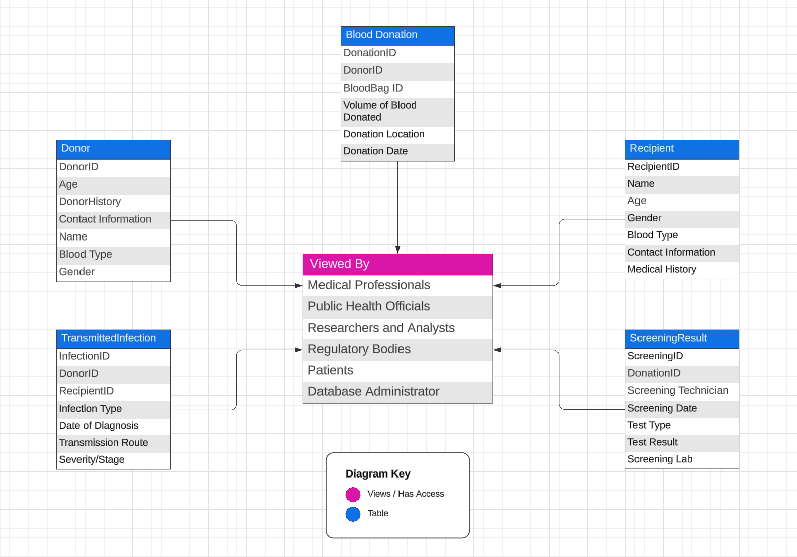

# Healthcare Analytics: Transmitted Infections among Blood Donors

## Overview
This repository contains the research and implementation details for the paper "Healthcare Analytics for Patient Care: Transmitted Infections among Blood Donors" by Rushil Patel and Saloni Desai. The project aims to analyze the prevalence and trends of transfusion-transmitted infections (TTIs) among blood donors, leveraging database technologies and data visualization.

## Table of Contents
- [Introduction](#introduction)
- [Contributors](#contributors)
- [Background](#background)
- [System Model and Problem Formulation](#system-model-and-problem-formulation)
- [Workflow](#workflow)
- [Experimental Setup](#experimental-setup)
- [E-R Diagram](#e-r-diagram)
- [SQL Code](#sql-code)

## Introduction
Transmitted infections present a significant healthcare concern in blood transfusions. This project addresses the challenge of preventing transfusion-transmitted diseases (TTDs) through comprehensive data analysis and implementation of stringent safety measures.

## Contributors
- Rushil Patel (22BCE308)
- Saloni Desai (22BCE309)

## Background
This section provides insights into the prevalence of TTIs among blood donors and emphasizes the importance of preventive strategies, such as education, awareness, and stringent screening protocols.

## System Model and Problem Formulation
### Problem Statement
Analyze transmitted infections among blood donors using SQL queries, database tables, ER diagrams, and graph visualization techniques.

### Scope
- Analyzing patterns and trends in TTIs.
- Utilizing SQL for data retrieval and analysis.
- Designing database tables and ER diagrams.
- Employing graph visualization for data representation.

## Workflow
1. **Collection of Blood from Donors**: Blood collection and donor information recording.
2. **Testing and Processing**: Blood testing for safety and quality, followed by component separation.
3. **Storage**: Safe storage of blood and its components.
4. **Cross-Matching**: Compatibility testing before transfusion.

## Experimental Setup
- **Operating System**: Windows 11 Home Edition
- **Database Management System**: Oracle Database 11g Express Edition
- **Hardware**: 
  - RAM: 16 GB
  - CPU: Intel i7-11800H
  - GPU: NVIDIA GeForce RTX 3060
  - Disk: Samsung 1 TB

## E-R Diagram
An ER diagram illustrating the relationships between the entities involved in blood donation and transfusion processes.

## SQL Code
The SQL scripts used to create and populate the database tables, including sample data for donors, blood donations, screening results, transmitted infections, and recipients. You can find the complete SQL file [here](Database.SQL).

